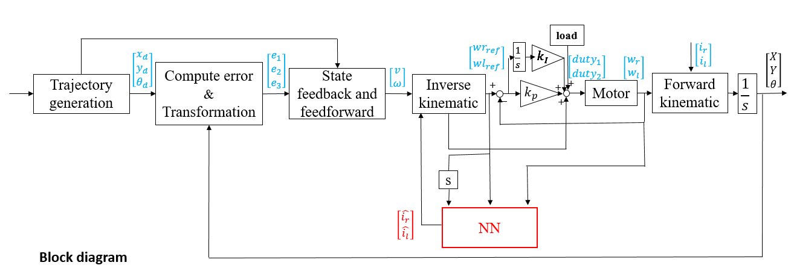

# TMR-slippage-simulation
This is a simulation of TMR robot system with slippage compensation

## Contents
- [Installation](#Installation)
- [Introduction](#Introduction)
- [System structure](#System-structure)
- [Usage](#Usage)
  - [slippage train.py](#slippage-train.py)
  - [slippage test.py](#slippage-test.py)
  - [DNN.py](#DNN.py)

## Installation
- Clone the package .

      git clone https://github.com/TigerWuu/TMR-slippage-simulation.git
      
- package

  download with pip(recommand) or conda
  
      pip install tensorfow
      pip install matplotlib 
      

## Introduction
We make the robot track the trajectory we desired while the influence of the slippage will bring to a bad result. We want to compensate the loss of the wheel speed caused by the slippage and find out the solution by adpative slippage estimation and neural network slippage prediction. This is a demostrate of the NN slippage prediction method.

## System structure

## Usage
- first, run "slippage_train.py" to get the NN model "slippage_predict"
 
- Next, run "slippage_test.py" to load the NN model "slippage_predict" and verify the compensation result
      
### slippage train.py
- modifying the reference trajectory can generate the different traning data
- the path must be generated by some rules

### slippage test.py
- There are four trajectory simulation ,saparately

 1. reference trajectory
 2. trajectory without slippage compensation
 3. trajectory with slippage compensation offline
 4. trajectory with slippage compensation online

- "ra" can be changed to modified the slippage when the time reach the time_step/3

      # ra = 1 ---> slippage remains
      # ra > 1 ---> slippage = slippage * ra
- "online" can switch the training status

      # online = True ---> online & offline
      # online = False ---> offline only
      
### DNN.py
NN model with

    activation function : sigmoid
    optimizer : GD

~~functional~~
